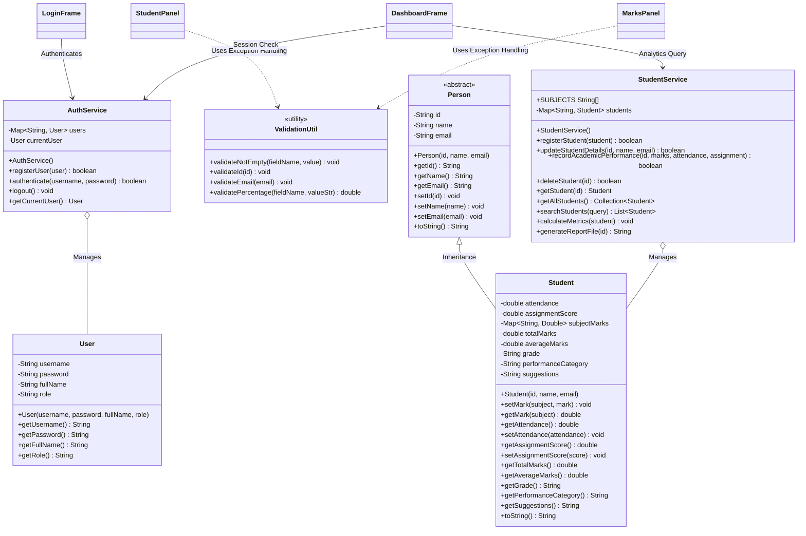

# UML Class Diagram - Student Performance Analyzer

This document presents the structural Class Diagram of the **Student Performance Analyzer** project, illustrating how the Object-Oriented elements (Inheritance, Abstraction, Encapsulation, and Services) connect.

---

## 1. Graphical Mermaid Diagram
*If your Markdown reader supports Mermaid, the diagram below will render graphically.*



---

## 2. Structured ASCII Diagram (Print & Offline Friendly)
*This formatted text diagram is highly clean and can be printed directly in reports.*

```text
 +=================================================================================+
 |                                   com.analyzer                                  |
 +=================================================================================+
 
                +---------------------------------------+
                |           <<abstract>>                |
                |              Person                   |
                +---------------------------------------+
                | - id : String                         |
                | - name : String                       |
                | - email : String                      |
                +---------------------------------------+
                | + Person(id, name, email)             |
                | + getters / setters()                 |
                | + toString() : String                 |
                +---------------------------------------+
                                    ^
                                    | (Inheritance)
                                    |
                +---------------------------------------+
                |               Student                 |
                +---------------------------------------+
                | - attendance : double                 |
                | - assignmentScore : double            |
                | - subjectMarks : Map<String, Double>  |
                | - totalMarks : double                 |
                | - averageMarks : double               |
                | - grade : String                      |
                | - performanceCategory : String        |
                | - suggestions : String                |
                +---------------------------------------+
                | + Student(id, name, email)            |
                | + setMark(subj, score) : void         |
                | + getMark(subj) : double              |
                | + getters / setters()                 |
                | + toString() : String                 |
                +---------------------------------------+

 +=================================================================================+
 |                                 Service Layer                                   |
 +=================================================================================+

      +---------------------------------+       +----------------------------------+
      |          AuthService            |       |          StudentService          |
      +---------------------------------+       +----------------------------------+
      | - users : Map<String, User>     |       | + SUBJECTS : String[]            |
      | - currentUser : User            |       | - students : Map<String, Student>|
      +---------------------------------+       +----------------------------------+
      | + AuthService()                 |       | + StudentService()               |
      | + authenticate(u, p) : boolean  |       | + registerStudent(s) : boolean   |
      | + registerUser(User) : boolean  |       | + recordPerformance() : boolean  |
      | + getCurrentUser() : User       |       | + searchStudents() : List        |
      | - loadUsers() / saveUsers()     |       | + calculateMetrics(s) : void     |
      +---------------------------------+       | + generateReportFile(id) : String|
                       |                        +----------------------------------+
                       | (Aggregates)                            |
                       v                                         v (Aggregates)
      +---------------------------------+       +----------------------------------+
      |             User                |       |             Student              |
      +---------------------------------+       +----------------------------------+
      | - username : String             |       | (Inherits base details           |
      | - password : String             |       |  and handles marks and           |
      | - fullName : String             |       |  advisory calculations)          |
      | - role : String                 |       +----------------------------------+
      +---------------------------------+
      | + User(u, p, name, r)           |
      | + getters / setters()           |
      +---------------------------------+

 +=================================================================================+
 |                               Utility & Helper                                  |
 +=================================================================================+

                        +-----------------------------------------+
                        |            ValidationUtil               |
                        +-----------------------------------------+
                        | - EMAIL_PATTERN : Pattern               |
                        +-----------------------------------------+
                        | + validateNotEmpty(field, val) : void   |
                        | + validateId(id) : void                 |
                        | + validateEmail(email) : void           |
                        | + validatePercentage(f, str) : double   |
                        +-----------------------------------------+
                                             |
                                             v (Throws nested exception)
                        +-----------------------------------------+
                        |           ValidationException           |
                        +-----------------------------------------+
                        | (Custom exception class representing    |
                        |  validation and format anomalies)       |
                        +-----------------------------------------+
```
